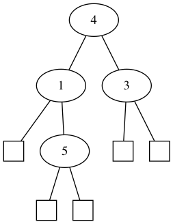

# 問1の解答

## (1)

```java
public static void main(String[] args) {
    // 問題中では使用されていないダイアモンド演算子を使用しても良い(おそらく) (確か Java 7 以降)
    Branch<String> ocamlBranch = new Branch<String>(new Leaf<String>(), "OCaml", new Leaf<String>());
    Branch<String> cBranch = new Branch<String>(new Leaf<String>(), "C", ocamlBranch);
    Branch<String> phpBranch = new Branch<String>(new Leaf<String>(), "PHP", new Leaf<String>());

    // 作成すべき Tree 本体
    Branch<String> javaBranch = new Branch<String>(cBranch, "Java", phpBranch);
}
```

## (2)



## (3)

```java
public static void main(String[] args) {
    // 問題中では使用されていないダイアモンド演算子を使用しても良い(おそらく) (Java 7 以降)
    Branch<String> ocamlBranch = new Branch<String>(new Leaf<String>(), "OCaml", new Leaf<String>());
    Branch<String> cBranch = new Branch<String>(new Leaf<String>(), "C", ocamlBranch);
    Branch<String> phpBranch = new Branch<String>(new Leaf<String>(), "PHP", new Leaf<String>());

    // 作成すべき Tree 本体
    Branch<String> javaBranch = new Branch<String>(cBranch, "Java", phpBranch);

    // (1) はここまで、以下は (3) のコード

    Tree<Integer> stringLengthTree = javaBranch.<Integer>map(String::length);
}
```
